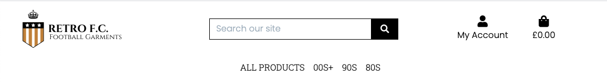

# Retro F.C.: Milestone Project 4

[Live Project](https://retro-fc.herokuapp.com/)

# Introduction
Retro F.C. is an e-commerce website created for the purpose of allowing people to purchase older retro footbal kits which you can no longer find in shops. Retro F.C. also has a store advertised on the site with its location.

### User Stories
| User Type | Users Wants |
| --------- | ----------- |
| Casual User | Navigate through the site and pages easily |
| Casual User | View the site across all devices |
| Casual User | View information as to where the in person store is |
| Casual User | Browse through football kits available |
| Casual User | Search and categorise football kits |
| Casual User | View a description of the kits |
| Casual User | Process of purchasing a kit, adding to bag along with a succesfull checkout |
| Registered User | View previous orders made |
| Registered User | Save address information for future use |
| Admin / Superuser | Add new products |
| Admin / Superuser | Update / Delete products |

# UX

**Wireframes**

When creating the initial design for the site, I used Figma to layout all the pages.

Various alterations were made throughout the process including footer changes, slight layout differences and colours used.

### Aim
* Create a site which allows Retro F.C. to create sales online for their football kits
* Create a site which easily allows users to navigate and purchase products without disruption to the process

### Design
Colour scheme was kept minimalistic to match the tone of the site, colours used were:
* Black (#000000)
* White (#FFFFFF)

**Typography**

2 [Google Fonts](https://fonts.google.com/) were used across the site:
* Poppins
* Roboto Slab

**Media**

All images were copyright free found using google images uploaded from other online stores. Logo created by myself on Canva.

# Features

### Navbar

* The navigation bar appears on every page, it includes the company logo and name in the top left corner, also acting as a link back to the home page. Navigation links go across the middle of the navigation bar with one drop down allowing easy categorising of products
* On smaller resolutions the navbar collapses and the links go to a collapsible menu on the top left, the company logo dissapears to then allow quick access to the search bar, account and bag buttons
* When logged in users are unable to click the register button on the navbar
* When logged in as a superuser, you are given an extra option under account for product management

### Footer
* The footer features copyright information along with a shortcut button to register on the site

### Individual Pages

### Home

* Hero image with a dark gradient over the top so text is more visible
* A "Shop Now" button allowing quick access to viewing all the products
* Text about who and what Retro F.C. is and does
* Advertising of the Retro F.C. store featuring a button which opens up google maps in a new page with the coordinates for the store
* Image of the inside of the store

### Products

* Product cards of all the products that have been added to the store via django admin or the product management page
* Filter button to sort items
* When logged in as admin the option to edit each product or delete will appear

### My Account

* When logged in can view previous orders made
* When logged in can edit address information for future orders

### Bag

* The bag page provides information on whats in the users bag along with details on how much it will cost individuall and altogether

# Technologies Used

* HTML - HTML5 is the latest version of Hypertext Markup Language, the code that describes web pages.
* CSS (Cascading Style Sheets) - CSS describes how HTML elements are to be displayed on screen.
* Python - Used throughout the site
* Bootstrap - Used to organise the layout of the site, navigation bar and footer
* Django - a high-level Python Web framework that encourages rapid development and clean, pragmatic design
* JavaScript - Used for various animations and functions.
* Heroku - Heroku is a platform as a service (PaaS) that enables developers to build, run, and operate applications entirely in the cloud.
* Google Fonts - Google Fonts is a library of free licensed font families.
* Stripe payments - Stripe offers payment processing software and application programming interfaces for e-commerce      websites and mobile applications.
* Gitpod - Code Editor used to create the site.
* GitHub - Used to host repos for the site.
* Chrome/Firefox/Bing DevTools - Regularly used to test the site (Primarily Chrome).
* W3C Markup Validation Service - Used to test code for errors.
* Figma - Collaborative interface design tool used for creating wireframes as well logos and SVGs.
* Randomkeygen - Used to generate random keys.

### Version Control
* Git - used for version control

### Libraries

* Bootstrap - is a framework for building responsive, mobile-first websites. I used materialize to create grid layouts, navbar, cards, forms, buttons and modals as well as features such as collapsibles, materialbox, tooltips and tabs.

# Database Structure
During development SQLite3 was used as the database, which is the default database used by Django. For deployment of this project, PostgreSQL database was used, as an add-on using Heroku.

Using Django Allauth and it's default django.contrib.auth.models, provided me with the the User model used in the profile app.

The structure of the Product and Checkout apps are guided by the Code Institute's walkthrough project, Boutique Ado.

# Deployment
**Local Deployment**

This repository may be cloned directly into an editor by pasting the following command into the terminal:
'''
git clone https://github.com/ryanjbm/retro-fc
'''

Alternatively, you can save a copy of this repository by clicking the green button "Clone or download" , then "Download Zip" button, and after extract the Zip file to your folder.

In the terminal window change directory (CD) to the correct file location (directory that you have just created).

Install all requirements from the requirements.txt file putting this command into your terminal:

pip3 install -r requirements.txt
Note: GitPod does not require sudo, so if you use another IDE, you will need to include sudo in the beginning of the command: sudo pip3 install -r requirements.txt.

Set up the following environment variables to use the full functionality of the site.

DANGO_SECRET_KEY = your secret key.

STRIPE_PUBLIC_KEY = your stripe public key.

STRIPE_SECRET_KEY = your stripe secret key.

STRIPE_WEBHOOK_SECRET = your stripe webhook secret.

IN_DEVELOPMENT = True

Your stripe variables can be found on your stripe dashboard.

You can generate a Django secret key here. Django Secret Key Generator

Then migrate:

$ python manage.py migrate
Populate the products, cats, contact, home, help apps with relavant fixtures:

$ python manage.py loaddata fixtures/<filename>.json
Create a superuser:

$ python manage.py createsuperuser
You will now be able to run the application using the following command

$ python3 manage.py runserver
Deployment to Heroku

The app may be deployed to Heroku using the following ste:

Create an app on the Heroku website.

Click on the new button.
Click on the create a new app.
Give the app a name and chose current region.
Select create app.
Set up Postgres Database

Heroku

In the app resources search for Postgres
Add to the project and, choosing the free plan.
To use Postgres install 2 dependencies.
dj_database_url
psycopg2
In Project.

Install the two packages needed

    pip3 install dj_database_url
    pip3 install psycopg2_binary
Add them to the requirements.txt file

pip3 freeze > requirements.txt
In settings.py import dj_database_url

import dj_database_url
Comment out the current database settings.

Replace them with the settings for the Postgres database.

    DATABASES = {
        'default': dj_database_url.parse('DATABASE_URL')
    }
Get database URL from app config settings. (I haven't shown it above as its and environmental variable and shouldn't be shown in version control)

Then migrate:

$ python manage.py migrate
Populate the products, cats, contact, home, help apps with relavant fixtures:

$ python manage.py loaddata fixtures/<filename>.json
Create a superuser:

$ python manage.py createsuperuser
Commit changes making sure to remove my database URL beforehand so it isn't saved in version control.

Create an if-else statement in the settings.py to use Postgres if the DATABASE_URL variable is available and if not use the default database

    if "DATABASE_URL" in os.environ:
        DATABASES = {
            "default": dj_database_url.parse(os.environ.get('DATABASE_URL'))
        }
    else:
        DATABASES = {
            'default': {
                'ENGINE': 'django.db.backends.sqlite3',
                'NAME': BASE_DIR / 'db.sqlite3',
            }
        }
The Postgres database is now ready for use.

Gunicorn

For the app to work install Greenunicorn.
To install:
pip3 install Gunicorn
Create a Procfile to let Heroku know how to run the app:
    touch Procfile
Then in Procfile place the following code:
    web: gunicorn <app name>.wsgi:application
Heroku in the command line.

Log into Heroku using the terminal.

    heroku login -i
Temporarily disable the static files until they have been set up on Amazon Aws.

    heroku config:set DISABLE_COLLECTSTATIC=1 --app <app name>
Use the --app command if you have more than one Heroku app.
Then in settings I added Heroku into allowed hosts, and localhost so my project can still be run locally.

    ALLOWED_HOSTS = ["<heroku app name>.herokuapp.com", "localhost"]
Commit changes to Github.

Then set up pushing to Heroku

    heroku git:remote -a <heroku app name>
Then push the project to Heroku

    git push heroku master
Heroku will now build your app.

Heroku Website

Connect app to GitHub by opening the Deploy section.
Searched for the repository.
Connect and then enabled Automatic Deploys.
This now means that any changes pushed to GitHub will be automatically pushed to Heroku as well.
Amazon AWS

Amazon AWS was used to store both static files and media files.

Firstly create an AWS account and work through the sign-up process. Once account is set up set the project up on AWS.

Create a bucket.

Create the bucket

Create a new bucket on the AWS S3 service.
From the main dashboard search for S3 and then click to get started.
Click on the Create bucket button.
Give the bucket a name and select region.
Then uncheck the block public access and acknowledge that the bucket will now be public.
Then click create bucket.
Bucket settings.

Properties
Navigate to the bucket properties settings.
Turn on static website hosting.
In the index and error add index.html and error.html.
Click Save.
Permissions
Click on the buckets Permissions tabs.
Firstly paste in the following cors config.
[
    {
        "AllowedHeaders": [
            "Authorization"
        ],
        "AllowedMethods": [
            "GET"
        ],
        "AllowedOrigins": [
            "*"
        ],
        "ExposeHeaders": []
    }
    ]
Then in the bucket policy tap, click on generate policy.
Policy
Select S3 bucket policy
Add * to the principal field to select all principals
Set the action to get object.
Paste in your ARN which is available on the previous page.
Click, add statement
Then click, generate policy.
Now copy and paste your new policy into the bucket policy.
Add /* onto the end of the resources key
Click Save.
Access control list
In the access control list tab set the list objects permission to everyone.
Create a User.

To create a user for the bucket search for IAM and select it.

Create a Group.

Firstly create a group to put user in.
Click create a new group and name it.
Click through to the end and save the group.
Create a policy.
In the group click, policy and then, create policy.
Select the JSON tab and then import managed policies.
Search S3 and select AmazonS3FullAccess and import.
In the resources section paste in the arn from before.
click through to review the policy.
Fill in name and description and then click generate policy.
Back in your group click permission and then attach the policy.
Find the policy you've just created and attach it.
Create the User.

Select Users from the sidebar and then click, add user.
Create a user name and select programmatic access then click next.
Then select the group to add user to.
Click through to the end and then click create user.
** Make sure to now download the CSV file as it contains the users keys needed to access from our app.**

